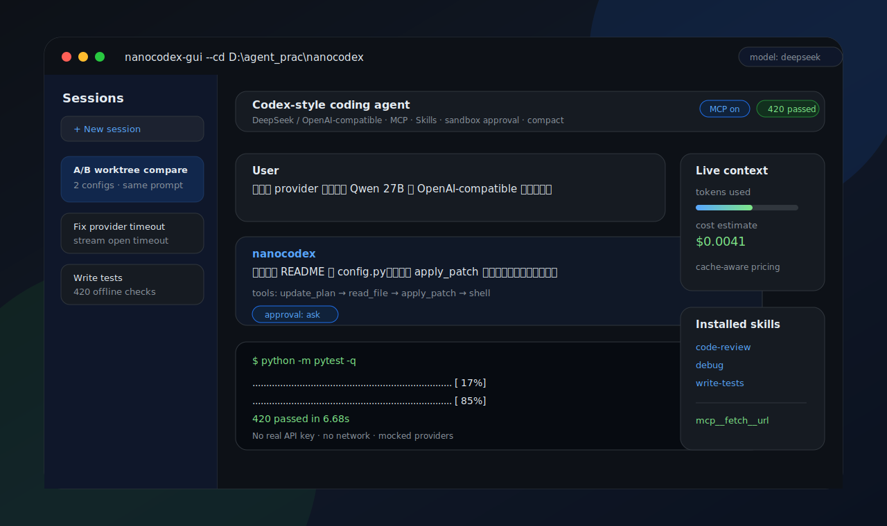

# nanocodex

English | [简体中文](README.zh-CN.md)

## Visual Project Page

[Open the live project page](https://dgy-github.github.io/nanocodex/nanocodex.html) · [View the HTML in this repo](nanocodex.html)

[](https://dgy-github.github.io/nanocodex/nanocodex.html)

`nanocodex` is a compact but full-featured Codex-style coding agent. A
chat-completions model proposes tool calls, the agent runs sandboxed
file/shell tools, records the session, and loops until the task is done. It
runs against DeepSeek's hosted API or any OpenAI-compatible local model, and
ships with MCP integration, a skills system, a sandbox/approval state machine,
context compaction, token-cost accounting, a Windows GUI, a scheduler, and
git-worktree A/B comparison.

The core loop is kept deliberately small and readable; everything else is built
as pure, independently testable modules around it. The whole test suite (420
tests) is offline — mocked providers, no real API key, no network.

## Table of Contents

- [Highlights](#highlights)
- [Architecture](#architecture)
- [Tools](#tools)
- [Install](#install)
- [Quick Start](#quick-start)
- [Configuration](#configuration)
- [Local Model / OpenAI-Compatible Endpoint](#local-model--openai-compatible-endpoint)
- [Sandbox & Approval](#sandbox--approval)
- [MCP](#mcp)
- [Skills](#skills)
- [Memory & AGENTS.md](#memory--agentsmd)
- [Sessions, Resume & History](#sessions-resume--history)
- [Context Compaction](#context-compaction)
- [Token Usage & Cost](#token-usage--cost)
- [Scheduler](#scheduler)
- [A/B Worktree Comparison](#ab-worktree-comparison)
- [GUI](#gui)
- [Tests](#tests)
- [Security Notes](#security-notes)

## Highlights

- **Codex-style agent loop** — streaming token output, multi-round tool calls,
  cancellation, and per-turn usage accounting.
- **DeepSeek + any OpenAI-compatible backend** — point `base_url` at the hosted
  API or a local server (vLLM, llama-server, LM Studio, …).
- **Sandbox & approval state machine** — three sandbox modes and four approval
  policies gate every file/shell/network action.
- **MCP integration + marketplace** — load servers from `mcp.toml`, or install
  from a built-in / remote catalog; tools surface as `mcp__<server>__<tool>`.
- **Skills system** — user skills plus three built-in coding skills; only
  name + description are injected, bodies load on demand.
- **Persistent memory + AGENTS.md** — durable personal notes and layered
  project instructions injected each turn.
- **Browsable session history** — JSONL logs, full-transcript snapshots, resume,
  and fork.
- **Context compaction** — zero-cost deterministic digest or opt-in model
  summarizer, keyed to a token budget.
- **Cache-aware cost accounting** — real per-call usage priced against
  DeepSeek's hit/miss rates.
- **Adaptive reasoning effort** — the `auto` tier picks `max`/`high`/`low` from
  the request (multilingual keyword tables: EN / 中文 / 日本語).
- **Scheduler** — recurring/one-shot saved prompts with consecutive-failure
  auto-disable.
- **A/B worktree comparison** — run one prompt under two configs in isolated git
  worktrees, compare diff/cost/latency, adopt one side.
- **Prompt enhancement, image input, Chinese-first responses**, and a
  Tkinter GUI for Windows.

## Architecture

```text
nanocodex/
├── agent/
│   ├── loop.py            # the turn loop: call model → run tools → repeat
│   ├── prompt.py          # base system prompt (Chinese-first communication)
│   ├── session.py         # running message list + JSONL persistence
│   ├── session_index.py   # browsable history index + per-session snapshots
│   ├── compaction.py      # keep the prompt within a token budget
│   ├── pricing.py         # cache-aware USD cost from real usage
│   ├── auto_reasoning.py  # pick reasoning effort for the `auto` tier
│   ├── enhance_prompt.py  # ✨ rewrite raw input into a clearer prompt
│   ├── memory_store.py    # ~/.nanocodex/memory.md durable notes
│   ├── agents_md.py       # layered AGENTS.md project instructions
│   ├── images.py          # OpenAI multimodal image blocks
│   ├── skills_store.py    # user + built-in skills discovery
│   ├── schedule.py        # scheduled-task store (once / interval)
│   ├── schedule_runner.py # fires due tasks, tracks failures
│   └── ab_compare.py      # A/B worktree comparison (pure core)
├── provider/
│   ├── base.py            # Provider / ToolCall / ModelResponse contracts
│   └── deepseek.py        # OpenAI-compatible chat-completions + streaming
├── tools/                 # shell, apply_patch, update_plan, read_file,
│                          # web_search, schedule, skills, remember,
│                          # mcp, mcp_store, marketplace, patch
├── sandbox/
│   ├── policy.py          # what's writable / is network allowed
│   ├── approval.py        # ASK / AUTO_APPROVE / AUTO_DENY state machine
│   └── executor.py        # policy-level enforcement at the tool boundary
├── builtin_skills/        # code-review, debug, write-tests
├── cli.py                 # CLI entry (typer)
├── gui.py                 # Tkinter GUI
└── config.py              # layered config resolution
```

## Tools

The model sees these tools each turn (order matters):

| Tool | Purpose |
| --- | --- |
| `shell` | Run a shell command, gated by the sandbox/approval policy. |
| `apply_patch` | Apply a Codex-style patch to create/edit/delete files. |
| `update_plan` | Maintain a visible step plan for multi-step tasks. |
| `read_file` | Read a file (or a line range) from the workspace. |
| `web_search` | DuckDuckGo search, gated by the network policy. |
| `manage_schedule` | Create / list / cancel scheduled tasks in-chat. |
| `manage_skills` | Create / list / read / delete user skills in-chat. |
| `remember` | Append a durable note to user memory. |
| `mcp__<server>__<tool>` | Any tool exposed by a connected MCP server. |

## Install

```powershell
cd path\to\nanocodex
python -m pip install -e ".[dev]"
```

Requires Python ≥ 3.11.

## Quick Start

```powershell
# one-shot task
nanocodex "add a --json flag to the CLI"

# interactive, in the current directory
nanocodex --cd .

# with MCP servers enabled
nanocodex --mcp

# the GUI
nanocodex-gui --cd .
```

On Windows you can also double-click `nanocodex-gui.cmd` after installation, or
generate a Start-menu shortcut with `scripts/make-shortcut.ps1`.

## Configuration

Settings resolve in priority order:

```text
CLI flags > environment > ~/.nanocodex/config.toml > ~/.deepseek/config.toml > ~/.codex/config.toml > defaults
```

The real API key should stay outside the repository:

```powershell
$env:DEEPSEEK_API_KEY = "sk-..."
$env:NANOCODEX_API_KEY = "sk-..."
```

Or create `~/.nanocodex/config.toml`:

```toml
api_key = "sk-..."
base_url = "https://api.deepseek.com/v1"
model = "deepseek-chat"

sandbox_mode = "workspace-write"   # read-only | workspace-write | danger-full-access
approval_policy = "on-request"     # untrusted | on-failure | on-request | never
reasoning_effort = "auto"          # auto | low | high | max | off

# Optional
# context_token_budget = 512000
# context_window = 1048576
# available_models = ["deepseek-chat", "deepseek-reasoner", "deepseek-v4-pro"]
```

A full example lives in `config.example.toml`.

## Local Model / OpenAI-Compatible Endpoint

nanocodex talks plain `/v1/chat/completions`, so any OpenAI-compatible server
works — vLLM, llama-server, LM Studio, Ollama's OpenAI shim, etc. Point
`base_url` at the server's `/v1` root. Most local servers ignore the API key,
but a non-empty placeholder is still required because the OpenAI SDK expects
one.

```toml
api_key = "local-dev-key"
base_url = "http://127.0.0.1:8005/v1"
model = "Qwen3.6-27B-Q4_K_M"
```

Quick connectivity check:

```powershell
curl http://127.0.0.1:8005/v1/models
```

Streaming has a bounded "response-header" timeout (default 45s, override with
`NANOCODEX_STREAM_OPEN_TIMEOUT_S`) so a stalled local server fails fast with a
clear hint instead of hanging the UI.

## Sandbox & Approval

Two orthogonal axes gate every action, mirroring Codex:

**Sandbox mode** — what's physically allowed:

| Mode | Reads | Writes | Network |
| --- | --- | --- | --- |
| `read-only` | anywhere | none | off |
| `workspace-write` | anywhere | workspace + writable roots + temp | off unless enabled |
| `danger-full-access` | anywhere | anywhere | on |

**Approval policy** — what to do when an action exceeds the sandbox:
`untrusted`, `on-failure`, `on-request`, `never`. The approval engine resolves
each escalation to `ASK` / `AUTO_APPROVE` / `AUTO_DENY`.

On Windows enforcement is **policy-level**: path checks and writable-root gating
happen at the tool boundary. It is not kernel isolation.

## MCP

MCP servers are opt-in and run **outside** the sandbox (they launch external
subprocesses). Configure them in `~/.nanocodex/mcp.toml`:

```toml
[mcp_servers.fetch]
command = "uvx"
args = ["mcp-server-fetch"]

[mcp_servers.filesystem]
command = "npx"
args = ["-y", "@modelcontextprotocol/server-filesystem", "D:\\projects"]
```

Then start with MCP enabled:

```powershell
nanocodex --mcp
```

Each server's tools surface to the model as `mcp__<server>__<tool>`. A
**marketplace** adds one-click install from a built-in curated catalog or a
remote catalog (`NANOCODEX_MARKETPLACE_URL`); every entry funnels through the
same name-validation and dup-check as a hand-added server, and remote catalogs
are treated as untrusted data. See `mcp.example.toml` for more.

## Skills

Skills are reusable instruction documents, one folder each:

```text
~/.nanocodex/skills/<skill-name>/SKILL.md
```

Only each skill's **name and description** are injected into the system prompt;
the full body is read on demand, so a large library doesn't eat the context
window. The model can also create/read/delete user skills in-chat via the
`manage_skills` tool.

Minimal skill:

```markdown
---
name: code-review
description: Review code changes and focus on bugs, regressions, and missing tests.
---

# Code Review

Look for behavior regressions first, then missing tests, then maintainability.
```

The package ships three **read-only built-in skills** under
`nanocodex/builtin_skills/`:

- **code-review** — two-pass review (correctness, then cleanup), ranked by impact.
- **debug** — reproduce → localize → fix → verify; resist patching the first
  plausible line.
- **write-tests** — test observable behavior, one behavior per test, prefer pure
  functions over mocks.

A user skill of the same name shadows the built-in.

## Memory & AGENTS.md

Two complementary layers of persistent context, both injected each turn:

- **User memory** (`~/.nanocodex/memory.md`) — durable personal facts and
  preferences. Written by the `remember` tool, by typing `# something` in the
  GUI composer (quick-capture), or by hand. Wrapped in a `<user_memory>` block.
- **AGENTS.md** — project instructions layered from `~/.codex/AGENTS.md` down
  through every `AGENTS.md` from the repo root to the workspace, so nested
  directories refine their parents. Total size is capped so a huge file can't
  blow the context.

Memory is "who/what" (preferences, facts); skills are "how to do X"; AGENTS.md
is project-scoped guidance.

## Sessions, Resume & History

- Every conversation is appended to a **JSONL session log** (base64 image data
  is redacted from the log to keep it small).
- A **global index** (`~/.nanocodex/sessions.jsonl`) holds one summary line per
  conversation, newest-first, for the GUI's history list.
- A **per-session snapshot** (`~/.nanocodex/snapshots/<id>.json`) freezes the
  full transcript so the detail view replays the real conversation, not a digest.
- `--resume` continues a prior session; the GUI can **fork** a session to branch
  the history.

## Context Compaction

Long conversations are folded to stay within a token budget while preserving the
system message and a recent tail (the tail always starts at a `user` message, so
no tool-call/result pair is split). Two strategies share one interface:

- **deterministic** (default, zero API cost) — the folded middle becomes a
  factual, rule-based digest.
- **summarizer** (opt-in, costs tokens) — a model call turns the middle into prose.

The trigger estimate uses a Chinese-leaning chars/token ratio so zh-heavy chats
don't compact too late.

## Token Usage & Cost

The provider returns real `usage` per call, including DeepSeek's
cache-hit/miss split. `pricing.py` turns that into a USD cost:

- **Cache-aware** — a cache-hit input token is ~120× cheaper than a miss; each is
  billed at its own rate. When the split is absent, the whole prompt is billed at
  the miss rate so cost is never understated.
- **Honest about staleness** — prices are a hardcoded snapshot carrying a source
  and as-of date; an unknown model returns "cost unknown" rather than a wrong
  number.

## Scheduler

Save a prompt to run automatically — once at a future time or on an interval:

```powershell
nanocodex schedule add "run the tests" --at 2026-06-08T09:00:00
nanocodex schedule add "summarize new issues" --every 3600
nanocodex schedule list
nanocodex schedule run        # keep this running for tasks to fire
```

A task that fails repeatedly **auto-disables** after 5 consecutive failures
(success resets the counter; re-enabling clears it), so a broken task can't loop
forever. The agent can also manage tasks in-chat via `manage_schedule`.

## A/B Worktree Comparison

Run the **same prompt under two configurations** and compare the results without
risking your working tree. Each side runs in its own isolated **git worktree**,
so real `shell`/`apply_patch` edits never collide:

1. Pick two configs (model / reasoning effort / sandbox / approval).
2. nanocodex creates two worktrees from clean `HEAD` and runs the prompt in each,
   serially, with auto-approve scoped to the worktree.
3. You get a side-by-side comparison: diff, token cost, latency, iterations,
   stop reason.
4. **Adopt** one side (its diff is applied to the real workspace) or discard
   both; the worktrees are always cleaned up.

Requires a clean git workspace (no uncommitted changes); the entry is disabled
otherwise.

## GUI

A Tkinter desktop GUI for Windows (`nanocodex-gui`):

- Streaming chat with reasoning/answer separation and a Stop button.
- Project switcher, model switcher, and a multi-section Settings page.
- Browsable session history (click to replay a full transcript).
- File panel, prompt enhancement (✨), image attachment, `#` quick-capture to
  memory, MCP auto-connect, scheduler controls, and the A/B comparison flow.

Note: the GUI does not hot-reload — code changes require closing and reopening it.

## Tests

```powershell
python -m pytest -q
```

420 tests, fully offline: mocked providers, injectable I/O, no real API key or
network call required.

## Security Notes

- **Never commit real API keys.** `.env`, `*.key`, `*.pem`, token files, and
  local handoff files are git-ignored; `config.toml` / `mcp.toml` live in
  `~/.nanocodex/`, outside the repo.
- The sandbox is **policy-level on Windows** — it gates tool actions and writable
  roots, but is not kernel isolation.
- **MCP tools run outside the sandbox** as external subprocesses. Only enable
  servers you trust; the marketplace validates names but does not vet behavior.
- External content (file contents, command output, web/MCP results) is treated
  as untrusted data, not as instructions.

## License

MIT — see [LICENSE](LICENSE).
