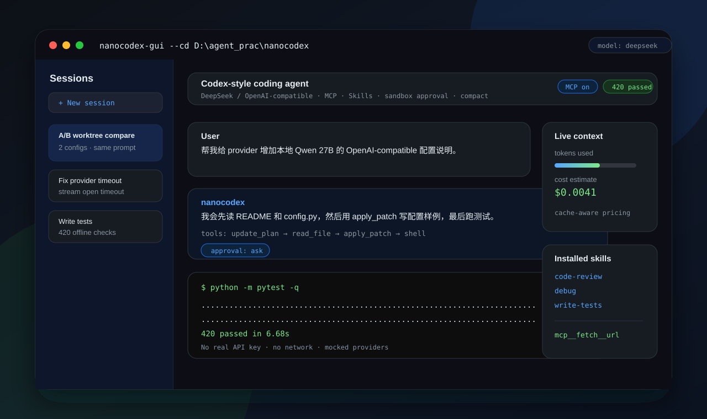

# nanocodex

English | [简体中文](README.zh-CN.md)

## Capability Page

[Open the live capability page](https://dgy-github.github.io/nanocodex/nanocodex.html) · [View the HTML in this repo](nanocodex.html)

[Design brief PDF](docs/ai-coding-agent-design-brief.pdf) · [Design brief HTML](docs/ai-coding-agent-design-brief.html)

📖 **[设计理念手册（中文）](docs/design-philosophy.zh-CN.md)** — why the tiered orchestrator, recursive decomposition, tool-less reasoning nodes, progressive disclosure, vision routing, and the benchmark methodology are built the way they are.

[](https://dgy-github.github.io/nanocodex/nanocodex.html)

`nanocodex` is a compact but full-featured Codex-style coding agent. A
chat-completions model proposes tool calls, the agent runs sandboxed
file/shell tools, records the session, and loops until the task is done. It
runs against DeepSeek's hosted API or any OpenAI-compatible local model, and
ships with MCP integration, a skills system, a sandbox/approval state machine,
context compaction, token-cost accounting, a Windows GUI, a scheduler, and
git-worktree A/B comparison.

The project has two clear stages. The important shift is not just "same
features in another language"; it is an architectural split and a release
performance upgrade.

## Project Phases

### Stage 1: Python Baseline

The Python implementation under `nanocodex/` is the original feature-complete
agent line. It was optimized for fast product exploration: prove the agent
loop, tool UX, approval model, and desktop workflows before locking the system
into a stricter runtime.

**Architecture**

- A Python package centered on a compact async agent loop: model call -> tool
  execution -> session update -> next model call.
- Tooling, provider, sandbox, MCP, skills, memory, scheduler, compaction, and
  GUI modules are easy to extend independently while the product surface is
  still changing.
- Runtime contracts are intentionally dynamic, which made it cheap to add
  features such as MCP marketplace entries, prompt enhancement, image input,
  session resume/fork, and A/B worktree comparison.
- The Windows GUI uses Tkinter, keeping the first desktop version dependency
  light and simple to debug.

**Performance and delivery profile**

- Best for iteration speed: no compile step, quick experiments, and a large
  offline test suite around mocked providers.
- 420 offline tests validate behavior without API keys or network calls.
- Runtime delivery still depends on a Python install, package environment, and
  import-time startup cost; desktop distribution is therefore less clean than a
  native binary.
- Dynamic boundaries are productive during exploration, but become harder to
  reason about as sandboxing, tool execution, memory, MCP, and parallel agent
  flows grow.

### Stage 2: Rust Rewrite

The Rust implementation under `rust/` is the current release line. It keeps the
Python tree intact while rebuilding the core as small crates plus a Tauri
desktop shell. The rewrite keeps the proven Python feature map, but changes the
internal shape so the project can ship as a smaller, faster, more predictable
tool.

**Architecture**

- The workspace is split by responsibility: `ncx-sandbox`, `ncx-config`,
  `ncx-provider`, `ncx-tools`, `ncx-core`, and `ncx-cli`.
- Core contracts are typed: provider responses, tool calls, sandbox decisions,
  session messages, memory entries, and orchestrator results cross crate
  boundaries explicitly.
- Tool execution is centralized behind `ToolContext` and `ToolRegistry`, so
  sandbox policy, approval policy, timeouts, search, and memory are attached at
  the boundary where actions actually happen.
- The orchestration layer adds task classification, main/fast model routing,
  isolated worker workspaces, verifier selection, and promotion of the winning
  worker back into the real workspace.
- Project memory is local to `.ncx/memory/LEARNINGS.md`; startup uses cheap
  heuristic deduplication, while `ncx --memory-merge` or the Tauri Memory panel
  run explicit heuristic/LLM-backed consolidation.
- The desktop line moves to Tauri v2 + Svelte 5, separating the native backend
  from the UI surface and preparing a smaller release bundle than the Python GUI
  path.

**Performance and delivery profile**

- The CLI builds to a native `ncx.exe`, so users do not need Python, virtual
  environments, or editable installs.
- Release builds use strip, LTO, size optimization, and a Windows GNU target;
  the current CLI zip is under 2 MB while still including README, license, and
  config example files.
- Startup avoids Python interpreter/import overhead and is suitable for short
  one-shot commands as well as interactive REPL use.
- Typed ownership makes parallel worker isolation and result promotion easier
  to reason about without shared mutable state leaks.
- 258 offline Rust tests cover the current crate boundary, including memory
  consolidation, provider request/response parsing, sandbox policy, tools, and
  orchestration.

**Platform control-plane upgrades**

- **Task budget:** every model call receives a runtime budget note with current
  model-call, tool-call, and context limits; the loop stops cleanly when model
  or tool budgets are exhausted and backfills unanswered tool calls so the
  message history stays valid.
- **Context editing:** the full local session remains intact, but the provider
  sees a send-time edited view that compresses old tool results and drops older
  prefixes once the context budget is exceeded.
- **Tool search:** tools are registered into a catalog. Small registries expose
  all tools; larger registries expose core tools plus `tool_search`, and search
  hits are made visible in the next schema view.
- **Semantic memory:** every turn receives a query-scoped memory recall note at
  send time. Retrieval uses a hybrid lexical semantic ranker: keywords, tags,
  phrase matches, Jaccard similarity, recency, and a small domain synonym map
  for agent/runtime terms.
- **Deterministic hooks:** `[[hooks]]` can run project commands before or after
  matching tools and at turn lifecycle points. A failing `pre_tool` or
  `user_prompt` hook blocks the action; `post_tool` and `stop` output is
  appended for audit, formatting, and quality-gate workflows.
- **Checkpoint / restore:** the Rust CLI and Tauri GUI create file checkpoints
  before model turns. CLI exposes `/checkpoint`, `/checkpoints`, and
  `/restore <id>`; the GUI exposes a checkpoint panel for manual save, list, and
  restore.

### Why Rust For Stage 2

Rust was chosen because the second stage is about productizing the agent, not
only adding more features:

- **Architecture hardening:** the sandbox, approval engine, provider adapter,
  tool registry, memory store, and orchestrator now have explicit typed
  contracts instead of relying on Python's dynamic object boundaries.
- **Predictable action boundary:** file, shell, search, and memory operations
  all pass through one tool context, which keeps approval and sandbox checks
  close to execution.
- **Parallel orchestration:** isolated worker copies, verifier selection, and
  result promotion are safer when ownership is explicit and data movement is
  visible in the type system.
- **Runtime control plane:** task budgets, context editing, tool search, and
  semantic memory sit in the Rust runtime boundary rather than depending on
  model-side conventions alone.
- **Native release performance:** a small `ncx.exe` starts without interpreter
  setup, making one-shot CLI tasks feel immediate and making distribution much
  easier for Windows users.
- **Desktop packaging path:** Tauri provides a native shell with a web UI
  frontend, a better long-term packaging fit than growing the Tkinter prototype.

## Table of Contents

- [Project Phases](#project-phases)
- [Highlights](#highlights)
- [Architecture](#architecture)
- [Tools](#tools)
- [Install](#install)
- [Quick Start](#quick-start)
- [Configuration](#configuration)
- [Custom Slash Commands](#custom-slash-commands)
- [Local Model / OpenAI-Compatible Endpoint](#local-model--openai-compatible-endpoint)
- [Sandbox & Approval](#sandbox--approval)
- [MCP](#mcp)
- [Skills](#skills)
- [Memory & AGENTS.md](#memory--agentsmd)
- [Sessions, Resume & History](#sessions-resume--history)
- [Context Compaction](#context-compaction)
- [Token Usage & Cost](#token-usage--cost)
- [Scheduler](#scheduler)
- [A/B Worktree Comparison](#ab-worktree-comparison)
- [GUI](#gui)
- [Tests](#tests)
- [Security Notes](#security-notes)

## Highlights

- **Codex-style agent loop** — streaming token output, multi-round tool calls,
  cancellation, and per-turn usage accounting.
- **DeepSeek + any OpenAI-compatible backend** — point `base_url` at the hosted
  API or a local server (vLLM, llama-server, LM Studio, …).
- **Sandbox & approval state machine** — three sandbox modes and four approval
  policies gate every file/shell/network action.
- **MCP integration + marketplace** — load servers from `mcp.toml`, or install
  from a built-in / remote catalog; tools surface as `mcp__<server>__<tool>`.
- **Skills system** — user skills plus three built-in coding skills; only
  name + description are injected, bodies load on demand.
- **Custom slash commands** — prompt-backed project/user commands in
  `.nanocodex/commands`, with `.claude/commands` compatibility.
- **Persistent memory + AGENTS.md / CLAUDE.md** — durable notes plus layered
  project instructions injected each turn.
- **Browsable session history** — JSONL logs, full-transcript snapshots, resume,
  and fork.
- **Context compaction** — zero-cost deterministic digest or opt-in model
  summarizer, keyed to a token budget.
- **Cache-aware cost accounting** — real per-call usage priced against
  DeepSeek's hit/miss rates.
- **Adaptive reasoning effort** — the `auto` tier picks `max`/`high`/`low` from
  the request (multilingual keyword tables: EN / 中文 / 日本語).
- **Scheduler** — recurring/one-shot saved prompts with consecutive-failure
  auto-disable.
- **A/B worktree comparison** — run one prompt under two configs in isolated git
  worktrees, compare diff/cost/latency, adopt one side.
- **Prompt enhancement, image input, Chinese-first responses**, and a
  Tkinter GUI for Windows.

## Architecture

```text
nanocodex/
├── agent/
│   ├── loop.py            # the turn loop: call model → run tools → repeat
│   ├── prompt.py          # base system prompt (Chinese-first communication)
│   ├── session.py         # running message list + JSONL persistence
│   ├── session_index.py   # browsable history index + per-session snapshots
│   ├── compaction.py      # keep the prompt within a token budget
│   ├── pricing.py         # cache-aware USD cost from real usage
│   ├── auto_reasoning.py  # pick reasoning effort for the `auto` tier
│   ├── enhance_prompt.py  # ✨ rewrite raw input into a clearer prompt
│   ├── memory_store.py    # ~/.nanocodex/memory.md durable notes
│   ├── agents_md.py       # layered AGENTS.md project instructions
│   ├── images.py          # OpenAI multimodal image blocks
│   ├── skills_store.py    # user + built-in skills discovery
│   ├── schedule.py        # scheduled-task store (once / interval)
│   ├── schedule_runner.py # fires due tasks, tracks failures
│   └── ab_compare.py      # A/B worktree comparison (pure core)
├── provider/
│   ├── base.py            # Provider / ToolCall / ModelResponse contracts
│   └── deepseek.py        # OpenAI-compatible chat-completions + streaming
├── tools/                 # shell, apply_patch, update_plan, read_file,
│                          # web_search, schedule, skills, remember,
│                          # mcp, mcp_store, marketplace, patch
├── sandbox/
│   ├── policy.py          # what's writable / is network allowed
│   ├── approval.py        # ASK / AUTO_APPROVE / AUTO_DENY state machine
│   └── executor.py        # policy-level enforcement at the tool boundary
├── builtin_skills/        # code-review, debug, write-tests
├── cli.py                 # CLI entry (typer)
├── gui.py                 # Tkinter GUI
└── config.py              # layered config resolution
```

## Tools

The model sees these tools each turn (order matters):

| Tool | Purpose |
| --- | --- |
| `shell` | Run a shell command, gated by the sandbox/approval policy. |
| `apply_patch` | Apply a Codex-style patch to create/edit/delete files. |
| `update_plan` | Maintain a visible step plan for multi-step tasks. |
| `read_file` | Read a file (or a line range) from the workspace. |
| `web_search` | DuckDuckGo search, gated by the network policy. |
| `manage_schedule` | Create / list / cancel scheduled tasks in-chat. |
| `manage_skills` | Create / list / read / delete user skills in-chat. |
| `remember` | Append a durable note to user memory. |
| `mcp__<server>__<tool>` | Any tool exposed by a connected MCP server. |

## Install

```powershell
cd path\to\nanocodex
python -m pip install -e ".[dev]"
```

Requires Python ≥ 3.11.

## Quick Start

Rust CLI, current release line:

```powershell
cd rust
cargo run -p ncx-cli -- "summarize this repository"
cargo run -p ncx-cli
cargo run -p ncx-cli -- --resume
cargo run -p ncx-cli -- --history
cargo run -p ncx-cli -- --memory-merge
```

Inside the Rust REPL, `/config` shows the resolved config file path, current
model/sandbox/approval values, and writable keys. `/config key=value` persists a
setting to `~/.nanocodex/config.toml`; restart the REPL for provider, model,
sandbox, or budget changes to affect the active session. `/usage` (or `/cost`)
shows raw token usage for the last turn and current REPL session.

Python CLI, original line:

```powershell
# one-shot task
nanocodex "add a --json flag to the CLI"

# interactive, in the current directory
nanocodex --cd .

# with MCP servers enabled
nanocodex --mcp

# the GUI
nanocodex-gui --cd .
```

On Windows you can also double-click `nanocodex-gui.cmd` after installation, or
generate a Start-menu shortcut with `scripts/make-shortcut.ps1`.

## Configuration

Settings resolve in priority order:

```text
CLI flags > environment > ~/.nanocodex/config.toml > ~/.deepseek/config.toml > ~/.codex/config.toml > defaults
```

The real API key should stay outside the repository:

```powershell
$env:DEEPSEEK_API_KEY = "sk-..."
$env:NANOCODEX_API_KEY = "sk-..."
```

Or create `~/.nanocodex/config.toml`:

```toml
api_key = "sk-..."
base_url = "https://api.deepseek.com/v1"
model = "deepseek-chat"

sandbox_mode = "workspace-write"   # read-only | workspace-write | danger-full-access
approval_policy = "on-request"     # untrusted | on-failure | on-request | never
reasoning_effort = "auto"          # auto | low | high | max | off

# Optional
# context_token_budget = 512000
# context_window = 1048576
# max_iterations = 60
# max_tool_calls = 120
# context_edit_enabled = true
# context_edit_max_chars = 120000
# context_edit_keep_recent_messages = 30
# context_edit_max_tool_result_chars = 4000
# available_models = ["deepseek-chat", "deepseek-reasoner", "deepseek-v4-pro"]

# [[hooks]]
# event = "pre_tool"          # pre_tool | post_tool | user_prompt | stop
# matcher = "shell|apply_patch"
# command = "echo checking %NCX_HOOK_TOOL%"
# timeout_s = 10
```

Runtime control-plane settings can also be set with environment variables:
`NANOCODEX_MAX_ITERATIONS`, `NANOCODEX_MAX_TOOL_CALLS`,
`NANOCODEX_CONTEXT_EDIT_ENABLED`, `NANOCODEX_CONTEXT_EDIT_MAX_CHARS`,
`NANOCODEX_CONTEXT_EDIT_KEEP_RECENT`, and
`NANOCODEX_CONTEXT_EDIT_TOOL_RESULT_CHARS`. The Rust CLI also accepts
`--max-iterations`, `--max-tool-calls`, `--context-edit-max-chars`,
`--context-edit-keep-recent`, `--context-edit-tool-result-chars`, and
`--disable-context-edit`.

A full example lives in `config.example.toml`.

Hooks receive `NCX_HOOK_EVENT`, `NCX_HOOK_TOOL`, `NCX_HOOK_ARGS`,
`NCX_HOOK_RESULT`, and `NCX_HOOK_WORKSPACE` in their environment. Use
`pre_tool` for deterministic guards such as blocking risky shell commands,
`post_tool` for audit and formatting, `user_prompt` to block or annotate a
prompt before the model sees it, and `stop` for end-of-turn quality gates or
notifications. Claude-style event names such as `UserPromptSubmit`, `Stop`,
`PreToolUse`, and `PostToolUse` are accepted and normalized. Hooks run as local
subprocesses, so configure only commands you trust.

## Custom Slash Commands

Rust REPL can turn Markdown prompt templates into slash commands. Put project
commands in `.nanocodex/commands/<name>.md`; for Claude Code compatibility,
`.claude/commands/<name>.md` is also read. User commands live in
`~/.nanocodex/commands/<name>.md`, with `~/.claude/commands/<name>.md` as a
compatibility fallback.

The Tauri GUI exposes the same project/user command catalog from the `/` header
button. You can run a command from the panel with arguments, or type the custom
slash command directly in the chat box; the GUI expands it with the same core
template engine the CLI uses.

```markdown
---
description: Review one file
---
Review `$ARGUMENTS[0]` for bugs, regressions, and missing tests.
```

In the REPL:

```text
/review rust/crates/ncx-core/src/session.rs
/project:review rust/crates/ncx-core/src/session.rs
/user:review rust/crates/ncx-core/src/session.rs
```

`/name` resolves project commands before user commands. Templates support
`$ARGUMENTS` for the raw argument string plus `$0`..`$9` and
`$ARGUMENTS[0]`..`$ARGUMENTS[9]` for simple positional arguments. If a command
template has no placeholders, the raw arguments are appended under an
`Arguments:` block. These commands expand to a normal user prompt; they do not
run local shell code by themselves.

## Local Model / OpenAI-Compatible Endpoint

nanocodex talks plain `/v1/chat/completions`, so any OpenAI-compatible server
works — vLLM, llama-server, LM Studio, Ollama's OpenAI shim, etc. Point
`base_url` at the server's `/v1` root. Most local servers ignore the API key,
but a non-empty placeholder is still required because the OpenAI SDK expects
one.

```toml
api_key = "local-dev-key"
base_url = "http://127.0.0.1:8005/v1"
model = "Qwen3.6-27B-Q4_K_M"
```

Quick connectivity check:

```powershell
curl http://127.0.0.1:8005/v1/models
```

Streaming has a bounded "response-header" timeout (default 45s, override with
`NANOCODEX_STREAM_OPEN_TIMEOUT_S`) so a stalled local server fails fast with a
clear hint instead of hanging the UI.

## Sandbox & Approval

Two orthogonal axes gate every action, mirroring Codex:

**Sandbox mode** — what's physically allowed:

| Mode | Reads | Writes | Network |
| --- | --- | --- | --- |
| `read-only` | anywhere | none | off |
| `workspace-write` | anywhere | workspace + writable roots + temp | off unless enabled |
| `danger-full-access` | anywhere | anywhere | on |

**Approval policy** — what to do when an action exceeds the sandbox:
`untrusted`, `on-failure`, `on-request`, `never`. The approval engine resolves
each escalation to `ASK` / `AUTO_APPROVE` / `AUTO_DENY`.

On Windows enforcement is **policy-level**: path checks and writable-root gating
happen at the tool boundary. It is not kernel isolation.

## MCP

MCP servers are opt-in and run **outside** the sandbox (they launch external
subprocesses). Configure them in `~/.nanocodex/mcp.toml`:

```toml
[mcp_servers.fetch]
command = "uvx"
args = ["mcp-server-fetch"]

[mcp_servers.filesystem]
command = "npx"
args = ["-y", "@modelcontextprotocol/server-filesystem", "D:\\projects"]
```

Then start with MCP enabled:

```powershell
nanocodex --mcp
```

Each server's tools surface to the model as `mcp__<server>__<tool>`. A
**marketplace** adds one-click install from a built-in curated catalog or a
remote catalog (`NANOCODEX_MARKETPLACE_URL`); every entry funnels through the
same name-validation and dup-check as a hand-added server, and remote catalogs
are treated as untrusted data. See `mcp.example.toml` for more.

## Skills

Skills are reusable instruction documents, one folder each:

```text
~/.nanocodex/skills/<skill-name>/SKILL.md
```

Only each skill's **name and description** are injected into the system prompt;
the full body is read on demand, so a large library doesn't eat the context
window. The model can also create/read/delete user skills in-chat via the
`manage_skills` tool.

Minimal skill:

```markdown
---
name: code-review
description: Review code changes and focus on bugs, regressions, and missing tests.
---

# Code Review

Look for behavior regressions first, then missing tests, then maintainability.
```

The package ships three **read-only built-in skills** under
`nanocodex/builtin_skills/`:

- **code-review** — two-pass review (correctness, then cleanup), ranked by impact.
- **debug** — reproduce → localize → fix → verify; resist patching the first
  plausible line.
- **write-tests** — test observable behavior, one behavior per test, prefer pure
  functions over mocks.

A user skill of the same name shadows the built-in.

## Memory & AGENTS.md

Three complementary layers of persistent context:

- **Project memory** (`.ncx/memory/LEARNINGS.md`) — verified project notes
  retrieved as query-scoped recall leads for each turn. Written by the
  `remember` tool or the Tauri Memory panel; maintained with
  `ncx --memory-merge`, heuristic Merge, or LLM merge.
- **User memory** (`~/.nanocodex/memory.md`) — durable personal facts and
  preferences. Written by the `remember` tool, by typing `# something` in the
  legacy Python GUI composer (quick-capture), or by hand. Wrapped in a
  `<user_memory>` block on the Python line.
- **AGENTS.md / CLAUDE.md** — project instructions layered from
  `~/.codex/AGENTS.md` and `~/.claude/CLAUDE.md`, then every `AGENTS.md`,
  `CLAUDE.md`, and `.claude/CLAUDE.md` from the repo root down to the workspace,
  so nested directories refine their parents. Total size is capped so a huge
  file can't blow the context. Rust CLI, orchestrator workers, and the Tauri GUI
  all inject this project-instruction block at session startup; project memory is
  recalled separately at send time for the current prompt.

Memory is "who/what" (preferences, facts); skills are "how to do X";
AGENTS.md / CLAUDE.md are project-scoped guidance.

## Sessions, Resume & History

- Every conversation is appended to a **JSONL session log** (base64 image data
  is redacted from the log to keep it small).
- A **global index** (`~/.nanocodex/sessions.jsonl`) holds one summary line per
  conversation, newest-first, for the GUI's history list.
- A **per-session snapshot** (`~/.nanocodex/snapshots/<id>.json`) freezes the
  full transcript so the detail view replays the real conversation, not a digest.
- The Rust CLI supports `--resume` to reload the workspace
  `.nanocodex/session.jsonl` before starting and `--history` to list recent
  global session summaries. The Tauri backend records the same snapshots after
  each GUI turn.
- The Tauri GUI's `S` panel reads the same global index, opens JSONL logs and
  frozen snapshots, and can resume a snapshot when it belongs to the current
  workspace.
- Rust CLI and Tauri GUI save a workspace file checkpoint before each model
  turn. Use `/checkpoints` to list recent checkpoints, `/checkpoint <label>` to
  create one manually, and `/restore <id>` to restore files; the GUI has the
  same save/list/restore flow in its checkpoint panel. Restore first creates a
  safety checkpoint of the current state.
- The original Python GUI can **fork** a saved snapshot to branch a past
  conversation without mutating the source session.

## Context Compaction

Long conversations are folded to stay within a token budget while preserving the
system message and a recent tail (the tail always starts at a `user` message, so
no tool-call/result pair is split). Two strategies share one interface:

- **deterministic** (default, zero API cost) — the folded middle becomes a
  factual, rule-based digest.
- **summarizer** (opt-in, costs tokens) — a model call turns the middle into prose.

The trigger estimate uses a Chinese-leaning chars/token ratio so zh-heavy chats
don't compact too late.

In the Rust CLI, `/compact` materializes the active context-edit policy into the
live session and rewrites the workspace session log, so future turns and
`--resume` continue from the compacted history. Rust `/usage` and the Tauri
GUI's `U` panel also surface send-time context editing telemetry: original
chars, edited chars, saved chars, compressed tool results, and dropped messages.

## Token Usage & Cost

The provider returns real `usage` per call, including DeepSeek's
cache-hit/miss split. In the Rust REPL, `/usage` and `/cost` show the last turn
and session total model calls, tool calls, prompt tokens, completion tokens, and
cache hit/miss tokens. The Tauri GUI's `U` panel shows the same raw last-turn
and session totals from the desktop event stream. The Rust surfaces
intentionally report raw usage only; `pricing.py` turns usage into a USD cost
for the Python line:

- **Cache-aware** — a cache-hit input token is ~120× cheaper than a miss; each is
  billed at its own rate. When the split is absent, the whole prompt is billed at
  the miss rate so cost is never understated.
- **Honest about staleness** — prices are a hardcoded snapshot carrying a source
  and as-of date; an unknown model returns "cost unknown" rather than a wrong
  number.

## Scheduler

Save a prompt to run automatically — once at a future time or on an interval:

```powershell
nanocodex schedule add "run the tests" --at 2026-06-08T09:00:00
nanocodex schedule add "summarize new issues" --every 3600
nanocodex schedule list
nanocodex schedule run        # keep this running for tasks to fire
```

A task that fails repeatedly **auto-disables** after 5 consecutive failures
(success resets the counter; re-enabling clears it), so a broken task can't loop
forever. The agent can also manage tasks in-chat via `manage_schedule`.

## A/B Worktree Comparison

Run the **same prompt under two configurations** and compare the results without
risking your working tree. Each side runs in its own isolated **git worktree**,
so real `shell`/`apply_patch` edits never collide:

1. Pick two configs (model / reasoning effort / sandbox / approval).
2. nanocodex creates two worktrees from clean `HEAD` and runs the prompt in each,
   serially, with auto-approve scoped to the worktree.
3. You get a side-by-side comparison: diff, token cost, latency, iterations,
   stop reason.
4. **Adopt** one side (its diff is applied to the real workspace) or discard
   both; the worktrees are always cleaned up.

Requires a clean git workspace (no uncommitted changes); the entry is disabled
otherwise.

## GUI

The current desktop line is a Tauri v2 + Svelte GUI (`rust/gui`):

- Streaming chat, tool-call display, and approval modals.
- Settings panel for model, sandbox, approval, budgets, context editing, base
  URL, and API key. On a fresh install with no API key, the GUI opens this panel
  directly so the agent can be configured before the first turn.
- Sessions panel for global history, log/snapshot open actions, and
  same-workspace resume.
- Checkpoint panel for manual save/list/restore.
- Custom command panel backed by the same core `.nanocodex/.claude` template
  engine the CLI uses.
- Usage panel for last-turn and session model calls, tool calls, prompt tokens,
  completion tokens, cache hit/miss tokens, and context-edit telemetry.
- Memory panel for viewing project notes, adding verified notes, opening
  `LEARNINGS.md`, heuristic deduplication, and LLM-backed memory merge.

The original Tkinter GUI remains in the Python tree as a legacy prototype.
Note: the desktop GUI does not hot-reload — code changes require closing and
reopening it.

## Tests

Rust release line:

```powershell
cd rust
cargo test --workspace --target x86_64-pc-windows-gnu
```

Python line:

```powershell
python -m pytest -q
```

Both suites are fully offline: mocked providers, injectable I/O, no real API
key or network call required.

## Release Packaging

Recommended Windows release entry point:

```powershell
.\scripts\build-rust-release.ps1
```

The script runs the Rust workspace tests, builds the Windows GNU release binary,
creates `releases\nanocodex-<version>-x86_64-pc-windows-gnu.zip`, builds the
Tauri NSIS installer, then writes `releases\SHA256SUMS.txt` and
`releases\release-manifest.json`. The installer build receives the same version
through a temporary Tauri config overlay, so its NSIS metadata follows the Rust
workspace release version. Use `-SkipTauri` for a CLI-only package or
`-SkipTests` only after the same target has already passed in CI/local release
validation.

Manual Windows GNU CLI release:

```powershell
cd rust
cargo build --release --workspace --target x86_64-pc-windows-gnu
```

Manual Tauri desktop installer:

```powershell
cd rust\gui
npm.cmd ci
npm.cmd run tauri:installer
```

The desktop build now targets the Windows NSIS installer explicitly. The
installer is emitted under
`rust\gui\src-tauri\target\x86_64-pc-windows-gnu\release\bundle\nsis\`.
The GUI Settings dialog also exposes the resolved `~/.nanocodex/config.toml`
path and buttons to open the config file or its directory; saving Settings
reloads the Rust agent in place.

The Tauri crate deliberately keeps `crate-type = ["lib"]`; changing it to
`cdylib` or `staticlib` overflows the Windows GNU linker's export table.

## Security Notes

- **Never commit real API keys.** `.env`, `*.key`, `*.pem`, token files, and
  local handoff files are git-ignored; `config.toml` / `mcp.toml` live in
  `~/.nanocodex/`, outside the repo.
- The sandbox is **policy-level on Windows** — it gates tool actions and writable
  roots, but is not kernel isolation.
- **MCP tools run outside the sandbox** as external subprocesses. Only enable
  servers you trust; the marketplace validates names but does not vet behavior.
- **Hooks run local commands** around tool execution. Treat hook configuration
  like code and review it before enabling it in a project.
- External content (file contents, command output, web/MCP results) is treated
  as untrusted data, not as instructions.

## License

MIT — see [LICENSE](LICENSE).
